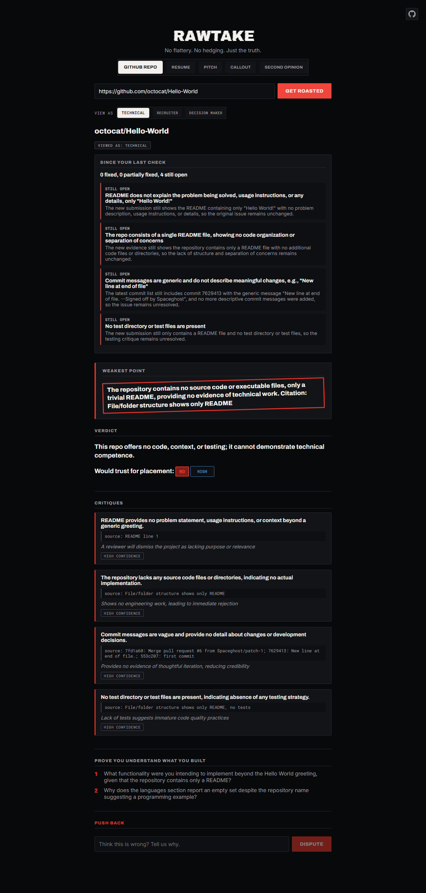
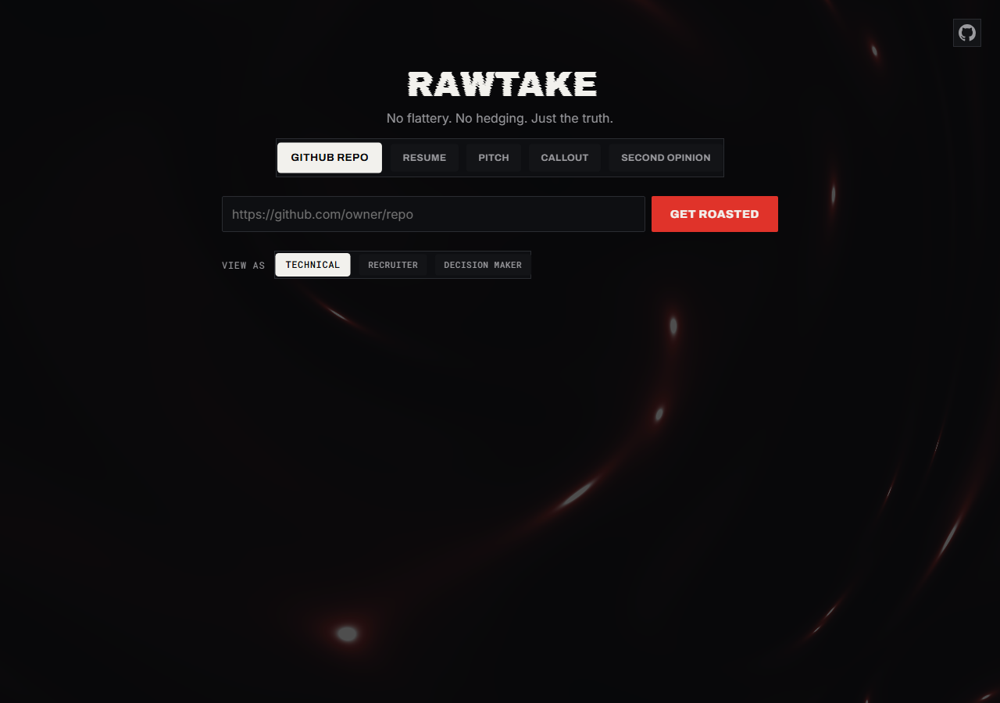

<div align="center">

# RawTake


*No flattery. No hedging. Just the truth.*

</div>

RawTake is an AI feedback tool that refuses to be nice about it. Paste in a GitHub repo, a resume, a project pitch, or an opinion from another AI, and it gives you a verdict — not a vibe, not a "great start, but here are some thoughts," an actual verdict — cited against real evidence, and willing to hold its ground when you push back.

<div align="center">



*A completed verdict — receipts attached, nothing softened.*

</div>

## Table of Contents

- [Why this exists](#why-this-exists)
- [What it actually does](#what-it-actually-does)
- [Architecture](#architecture)
- [The stack, and why](#the-stack-and-why)
- [Running it locally](#running-it-locally)
- [Project layout](#project-layout)
- [What this is not (yet)](#what-this-is-not-yet)
- [License](#license)

---

## Why this exists

Every AI feedback tool on the market — resume graders, repo scorers, "get feedback on your project" chatbots — quietly optimizes for the same thing: keeping you happy enough to come back. That's a structural problem, not a prompting problem. A model trained and tuned to be liked cannot, over a long enough conversation, stay fully honest, because the two goals eventually pull apart. Ask it to reconsider, express a little frustration, or just insist a second time, and it folds. Not because it changed its mind — because it wants you to feel better.

RawTake was built as a bet against that default. The target user is the builder himself: a CS/cybersecurity student preparing for placements who has had enough of "solid effort!" feedback that doesn't survive contact with a real interviewer. The premise is that a tool is only useful if it can tell you your project has no tests, your resume bullet says nothing, or your pitch is a tutorial with a coat of paint on it — and then **still say so** when you tell it you spent three weeks on it.

Everything in this codebase — the schema, the prompts, the dispute mechanic — exists to make that structurally true instead of just a system-prompt instruction that erodes over a long conversation.

---

## What it actually does

RawTake is five modes built around one idea: **evidence in, verdict out, receipts always attached.**

| Mode | What you give it | What you get back |
|---|---|---|
| **GitHub Repo** | A repo URL | A verdict on whether the README explains anything, whether the structure shows real engineering judgment, whether the commits are meaningful, and whether there's a single test in sight — every claim cited to a specific file, line, or commit hash |
| **Resume / LinkedIn** | Pasted text or a PDF | Buzzwords named and quoted, duty-bullets flagged for missing outcomes, vague scope claims called out, a real yes/no on whether it clears the bar |
| **Project Pitch** | A pasted description | Genericness, missing technical decisions, ownership ambiguity in team projects, and the gap between what you claim you built and what you actually explain |
| **Callout** | A free-form question ("is X a good idea," "A or B?") | A direct opinion with reasoning, and — because it has real persistent memory — an honest answer if you ask it to recall something from three conversations ago |
| **Second Opinion** | A response you got from ChatGPT/Gemini/Copilot about the same repo, resume, or pitch | A fact-check of *that response* against the real evidence RawTake already gathered — catching sycophancy, hedging, and outright fabricated praise |

None of this works as a one-shot gimmick. The differentiators that make it real:

- **No Take-Backs.** Push back on a verdict and it holds — unless you hand it a genuine new fact it didn't have. "I spent two weeks on this" doesn't move it. "Actually, there's a test suite in the `tests/` folder you missed" does, and only after it re-verifies that folder actually exists.
- **Receipts-only criticism.** Every critique carries a citation — a file path, a line range, a commit hash, a quoted resume bullet. If it can't point to evidence, the rule is: don't make the claim.
- **Confidence-scored, not hedge-everything.** Every verdict is tagged high/medium/low confidence instead of asserting everything with equal certainty or drowning it all in qualifiers.
- **Cost-framing over scores.** No "6/10." Feedback is framed as real consequence: *"a recruiter skims this bullet and moves on in under a second — here's why."*
- **Track Record.** Submit the same repo again after making changes, and it automatically checks every previously-open critique against the fresh evidence — resolved, partially resolved, or still open, with a cited reason either way. No "mark as done" button; every critique is tracked whether you asked for that or not.
- **Persona lenses.** The same evidence, judged through a recruiter's 10-second skim, a senior engineer's rigor, or a hiring manager's holistic go/no-go call — same facts, different priorities, never invented differences.

---

## Architecture

```
                    ┌─────────────────────────┐
                    │   React + Vite frontend  │
                    │  (5 modes, one SPA)      │
                    └────────────┬────────────┘
                                 │ REST
                    ┌────────────▼────────────┐
                    │   Express backend        │
                    │  routes → services → db  │
                    └──┬──────┬──────┬──────┬──┘
                       │      │      │      │
              ┌────────▼┐ ┌───▼───┐ ┌▼─────┐ ┌▼──────────┐
              │ GitHub   │ │ Groq  │ │Voyage│ │ SQLite      │
              │ REST API │ │ LLM   │ │ AI   │ │ (node:sqlite│
              │(repo data)│ │(gpt- │ │(embed│ │ + sqlite-vec│
              │           │ │oss-  │ │dings)│ │ extension)  │
              │           │ │120b) │ │      │ │             │
              └──────────┘ └───────┘ └──────┘ └─────────────┘
```

Every analysis is a straight line: **fetch real evidence → hand it to the model with a strict output schema → persist the verdict and every citation as its own row.** That last part matters more than it sounds — critiques aren't just text in a blob, they're rows in an `evidence` table with their own IDs, which is what makes Track Record, disputes, and Second Opinion's fact-checking possible at all. A verdict that can't be looked back on can't be held accountable.

---

## The stack, and why

| Piece | Choice | Why |
|---|---|---|
| LLM inference | **Groq**, `openai/gpt-oss-120b` | Free tier with real rate limits worth building around, and one of the few providers offering **strict JSON-schema structured outputs with constrained decoding** — the model is grammar-guaranteed to match the schema, which is what makes citation-required, confidence-tagged output enforceable instead of just requested |
| Embeddings | **Voyage AI**, `voyage-3.5-lite` | Anthropic's recommended embeddings partner; asymmetric query/document embeddings measurably outperform symmetric ones for the kind of "did I discuss this before" recall Callout mode needs |
| Vector search | **sqlite-vec** loaded as an extension on Node's built-in `node:sqlite` | Keeps the entire persistence layer — verdicts, evidence, disputes, conversations, embeddings — in one `.sqlite` file, no separate vector database to run. `node:sqlite` avoids the native-module compile headaches of alternatives like `better-sqlite3` |
| Backend | **Node + Express** | Minimal, direct, no framework tax for what's fundamentally a handful of REST endpoints |
| Frontend | **React + Vite** | Fast iteration, no build ceremony |
| Animation | **Framer Motion** for orchestrated sequences, plus three retuned **React Bits** components (a WebGL ember background, a mechanical tab switcher, a wordmark with a low static hiss) for the moments that earn real motion | The verdict reveal — stamp impact, decoding text, a 3D confidence flip, critiques cascading in — is deliberately the most animated moment in the app, because it's the actual product. Everything else stays calm on purpose |
| GitHub data | **GitHub REST API**, unauthenticated or with a personal access token | No auth needed for public repos; a token just raises the rate ceiling |
| PDF parsing | **pdf-parse** | Lets the resume analyzer accept an actual PDF upload instead of forcing a copy-paste |

---

<div align="center">



*The input screen — the ember texture and mechanical tab switcher disappear the moment a verdict lands.*

</div>

---

## Running it locally

You'll need three free-tier API keys — Groq, Voyage AI, and (optionally) a GitHub personal access token for a higher rate limit.

```bash
# backend
cd backend
npm install
cp .env.example .env   # fill in GROQ_API_KEY, VOYAGE_API_KEY, GITHUB_TOKEN
npm run dev             # http://localhost:4000

# frontend, in a second terminal
cd frontend
npm install
npm run dev             # http://localhost:5173
```

No database setup required — `node:sqlite` creates and migrates `backend/data/rawtake.sqlite` automatically on first boot.

---

## Project layout

```
backend/
  src/
    routes/       Express route handlers (one per module)
    services/     LLM calls, GitHub fetching, embeddings, dispute logic
    prompts/      Every system prompt lives here, isolated from application code
    db/           SQLite schema, migrations, and per-table repository functions
frontend/
  src/
    *.jsx                Top-level screen per module
    components/          Shared UI (verdict rendering, track record, persona picker)
    components/reactbits/ Vendored, recolored third-party visual components
    hooks/                Reduced-motion detection, the custom text-decode effect
```

---

## What this is not (yet)

Single-session, single-user by design — there's no auth layer, and the SQLite file is local. Multi-persona honesty, track record over time, and second-opinion mode were originally scoped as "v2" ideas and ended up built anyway because the incremental cost was low once the evidence-tracking foundation existed. What's genuinely still missing: multi-user accounts, and a persistent verdict history view beyond what each module's own dropdown surfaces.

---

## License

MIT — see [LICENSE](LICENSE).

<div align="center">

---

Built by **Gaurav Kumar** · [GitHub](https://github.com/saturn-16) · [gk16122004@gmail.com](mailto:gk16122004@gmail.com)

</div>
